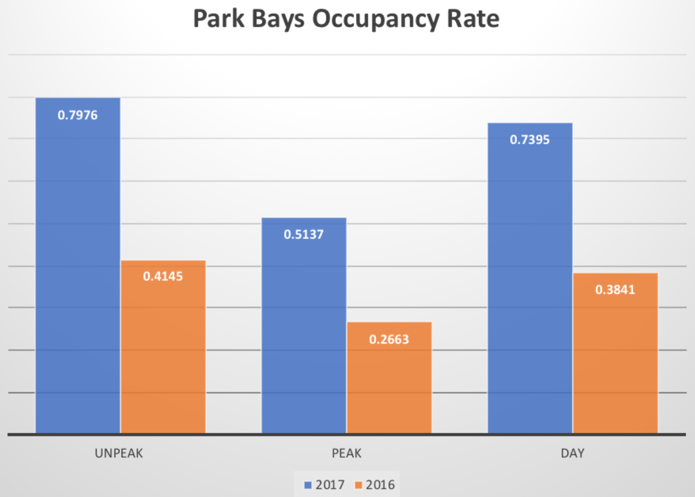
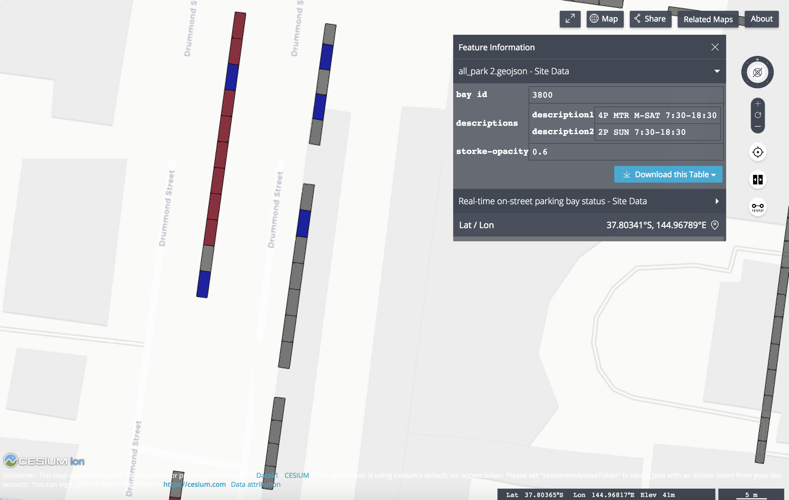

# Happy Parking

[Live demo](http://13.236.60.79/) is available here.

**The Problem**\
(Problem description)

**Our aims**\
The Happy Parking! project aims to make the most use of the open-source data from government solving practical problems and tell stories of urban development according to historical car park data.

**Part 1**

Parkers aim to create a <b>real-time web app</b> for end-users, helping drivers to find a vacant spot efficiently. 

>It allows users to select the location they want to go and get them all vacant car parks in the area within 500 m and match the car park restrictions with duration they are willing to park. It has a priority rank for the matching function -- free first, within the area, outside area. 

>At the government end, the real-time parking solution can help reduce the air pollution or traffic problem that caused by circling vehicles for vacant spaces as well as reduce the time wasted in finding a vacant spot, especially in the city area. 
>
>On the other hand, the visualization shows the land utilization in a more straightforward way, which supports the government to monitor and make a decision to improve quality of life. 

**Part 2**

In addition, the web app also provides a visualization regarding the analysis of the <b>parking area occupancy rate</b> based on historical data of the past years.

>It demonstrates the occupancy rate changes in each street with inground sensors according to their timestamps. Regarding these car park analysis data, it enables users to understand the urban planning in Melbourne and the changes in economic centres. Moreover, support the government’s urban planning decision in car parking, Remove car parks with low occupancy rate and build greenspace or improve public transportation network construction to reduce car park stress.

## Features

### On-street parking bay usage
 * We aims to discover and better utilise the benefits of public parking space in Melbourne CBD. 
 * We calculated the usage of parking space from the 2016/2017 On-street Car Parking Sensor Data. 
    

### Real-time on-street parking bay occupation status
 * We also combined different dataset provided by the [City of Melbourne](https://data.melbourne.vic.gov.au/). 
 * We provided useful information about the vacant parking space in the city.
    
    * **We may improve the usage of vacant parking space by enabling a _booking_ system**

  
## Used Datasets
1. [On-street Parking Bay Sensors](https://data.melbourne.vic.gov.au/Transport-Movement/On-street-Parking-Bay-Sensors/vh2v-4nfs)
1. [On-street Parking Bays](https://data.melbourne.vic.gov.au/Transport-Movement/On-street-Parking-Bays/crvt-b4kt)
1. [On-street Car Park Bay Restrictions](https://data.melbourne.vic.gov.au/Transport-Movement/On-street-Car-Park-Bay-Restrictions/ntht-5rk7)
1. [On-street Car Parking Sensor Data - 2017](https://data.melbourne.vic.gov.au/Transport-Movement/On-street-Car-Parking-Sensor-Data-2017/u9sa-j86i)
1. [On-street Car Parking Sensor Data - 2016](https://data.melbourne.vic.gov.au/Transport-Movement/On-street-Car-Parking-Sensor-Data-2016/dj7e-rdx9)
1. [On-street Car Parking Sensor Data - 2015](https://data.melbourne.vic.gov.au/Transport-Movement/On-street-Car-Parking-Sensor-Data-2015/apua-t2tb)
1. [On-street Car Parking Sensor Data - 2014](https://data.melbourne.vic.gov.au/Transport-Movement/On-street-Car-Parking-Sensor-Data-2014/t6hb-9uf2)
1. [Off-street car parks with capacity and type](https://data.melbourne.vic.gov.au/Property-Planning/Off-street-car-parks-with-capacity-and-type/krh5-hhjn)

## Dependencies
* [TerriaJS](https://github.com/TerriaJS/terriajs)
* [Flask](http://flask.pocoo.org)
* [Flase-CORS](https://flask-cors.readthedocs.io/en/latest)
* [GeoPandas](http://geopandas.org)
* [Python-GeoJSON](https://github.com/frewsxcv/python-geojson)
  
## TerriaMap prerequisites and scripts
These tools are required for build and run _TerriaMap_:
* Node.js
* GDAL (try `brew install gdal`)

Therea re some useful _TerriaMap_ commands. Use these under the `terriamap` folder.
* `npm install`: Install the dependencies of the _TerriaMap_. (node_modules)
* `npm run gulp`: Build the _TerriaMap_.
* `npm start`: Start the _TerriaMap_ at `localhost:3001`. 4 processes will be started in the background.
* `npm stop`: Stop the _TerriaMap_, Terminate the 4 processes.
